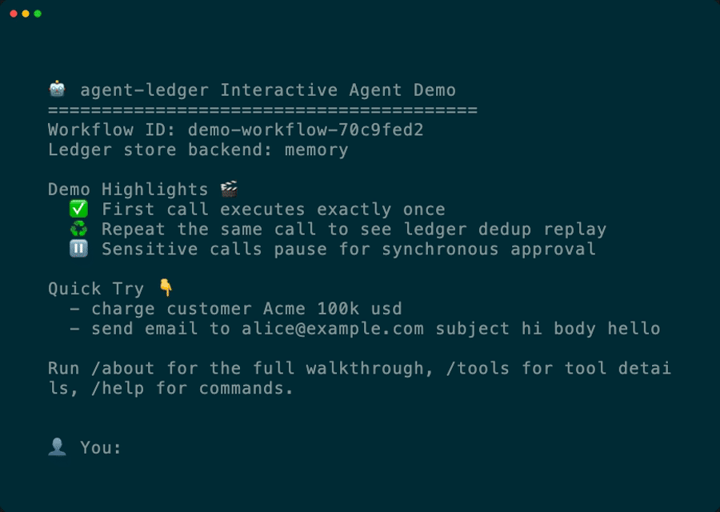

<div align="center">

[](https://www.fontspace.com/category/pixel)

<h3>
AI agents retry. Side effects shouldn't.
</h3>

---

<div align="center">

<h3>Idempotent tool execution for AI agents</h3>

<p>
Safe retries, crash recovery, and multi-worker coordination.
</p>

<p>
<b>Idempotency + replay</b> • same tool + args (+ scope) → same effect → return recorded result<br/>
<b>Intent-bound approvals</b> • approve the exact tool call + args (no “approve X, run Y”)<br/>
<b>Queryable receipts</b> • every side effect recorded (inputs, outputs, timing, status)
</p>

<p>
<b>Framework-agnostic:</b> wrap any async Python tool handler. Examples: <a href="examples/langchain/">LangGraph</a> / <a href="examples/openai-functions/">OpenAI</a> / <a href="examples/crewai/">CrewAI</a> / <a href="examples/openai-agents/">OpenAI Agents SDK</a>.
</p>

<p>
<a href="https://badge.fury.io/py/agent-ledger"></a>
<a href="https://github.com/rune0-dev/agent-ledger/actions/workflows/ci.yml"></a>
<a href="https://www.python.org/downloads/"></a>
<a href="https://opensource.org/licenses/Apache-2.0"></a>
<a href="https://discord.gg/snP6PYvgn2"></a>
</p>

<p>
<a href="https://github.com/rune0-dev/agent-ledger-demo"><b>Try Interactive Demo</b></a> • <a href="#installation"><b>Install Library</b></a>
</p>

</div>


</div>

<div align="center">

<p>
<b>Interactive demo:</b> approval gate → execute once → replay safely → inspect receipts via <code>/effects</code>
</p>



<p>
<a href="https://github.com/rune0-dev/agent-ledger-demo"><b>Run this demo in ~2 minutes →</b></a>
</p>

</div>

---

## Table of Contents

- [Interactive Demo (2 Minutes)](#interactive-demo-2-minutes)
- [Why This Exists](#why-this-exists)
- [Installation](#installation)
- [Quick Start](#quick-start)
- [The "Pause Button" for Your Agent (Human-in-the-loop)](#the-pause-button-for-your-agent-human-in-the-loop)
- [With LangChain](#with-langchain)
- [How It Works](#how-it-works)
- [More Examples](#more-examples)
- [When to Use This](#when-to-use-this)
- [Why Not...?](#why-not)
- [FAQ](#faq)
- [Core API](#core-api)
- [License](#license)

---

## Interactive Demo (2 Minutes)

If you want to feel the behavior before integrating, run the official interactive demo:

```bash
git clone https://github.com/rune0-dev/agent-ledger-demo
cd agent-ledger-demo

python3 -m venv .venv
source .venv/bin/activate
python -m pip install -e .

export OPENAI_API_KEY='sk-...'
agent
```

Try this sequence:

- `charge customer Acme 100k usd` (approval requested + effect created)
- Approve with `y` when prompted
- Repeat the exact same request (dedup replay, no duplicate charge)
- `/effects` (inspect recorded effects and dedup count)

See the full demo source in [`agent-ledger-demo`](https://github.com/rune0-dev/agent-ledger-demo).

---

## Why This Exists

**LLMs are non-deterministic. Your APIs aren't.**

When an agent crashes or retries, it doesn't remember what it already did:

- A tool call **times out** → the agent retries → **the side effect happens twice** (charge/email/ticket).
- The run crashes mid-step → **you can’t tell which tools executed** (no receipts).
- Multiple workers pick up the same task → **duplicate external actions** (at-least-once).
- A human approves one action → **the agent runs a different one** (arg drift).

`agent-ledger` sits between your agent and the outside world:

| Problem | How agent-ledger helps |
|---------|------------------------|
| Agent retried → API called twice | **Idempotency**: same tool + args (+ scope) → same effect → recorded result replayed, handler skipped |
| "What did the agent actually do?" | **Audit trail**: every call recorded with inputs, outputs, timing |
| Two workers hit the same task | **Concurrency**: first writer wins, others wait for the recorded result |
| Process crashed mid-execution | **Crash recovery**: new process reads the ledger, resumes safely |
| Agent deployed without permission | **Approvals**: sensitive tools pause until a human approves |

---

## Installation

```bash
# To use in dev-mode with MemoryStore
pip install agent-ledger

# To use in production-mode with PostgresDB
pip install agent-ledger[postgres]
```

## Quick Start

```python
import asyncio
from psycopg_pool import AsyncConnectionPool
from agent_ledger import EffectLedger, EffectLedgerOptions, ToolCall
from agent_ledger.stores.postgres import PostgresStore, SCHEMA_SQL

async def charge_customer(effect):
    print(f"Charging {effect.args_canonical}...")
    return {"status": "charged", "id": "ch_123"}

async def main():
    # Connect to Postgres
    pool = AsyncConnectionPool(conninfo="postgresql://localhost/mydb")
    async with pool.connection() as conn:
        await conn.execute(SCHEMA_SQL)  # Create table if needed

    store = PostgresStore(pool=pool)
    ledger = EffectLedger(EffectLedgerOptions(store=store))

    # First call: executes the handler
    result = await ledger.run(
        ToolCall(
            workflow_id="order-123",
            tool="stripe.charge",
            args={"amount": 1000, "currency": "usd"},
        ),
        handler=charge_customer,
    )
    print(f"First call: {result}")

    # Second call: same inputs → returns recorded result (handler not called)
    result2 = await ledger.run(
        ToolCall(
            workflow_id="order-123",
            tool="stripe.charge",
            args={"amount": 1000, "currency": "usd"},
        ),
        handler=charge_customer,
    )
    print(f"Second call: {result2}")
    # Handler only executed once. No double charge.

asyncio.run(main())

# For quick prototyping without Postgres:
# from agent_ledger import MemoryStore
# store = MemoryStore()  # In-memory, not durable
```

**Output:**

```
Charging {"amount":1000,"currency":"usd"}...
First call: {'status': 'charged', 'id': 'ch_123'}
Second call: {'status': 'charged', 'id': 'ch_123'}
```

Same inputs → same hash → same result. The handler only runs once.

---

## The "Pause Button" for Your Agent (Human-in-the-loop)

High-stakes operations can require human approval before execution. Use the `requires_approval` policy hook to decide dynamically:

```python
from agent_ledger import LedgerHooks, ToolCall

# Define a policy: which tool calls need approval?
def approval_policy(call: ToolCall) -> bool:
    # Large payments need approval
    if call.tool == "stripe.charge" and call.args.get("amount", 0) > 1000:
        return True
    # Production deploys need approval
    if call.tool == "k8s.deploy" and call.args.get("env") == "production":
        return True
    return False

# Notification hook: fires when approval is required
async def notify_slack(effect):
    await slack.post_message(
        channel="#approvals",
        text=f"Approval needed: {effect.tool}",
        blocks=[...],  # Include approve/deny buttons with effect.idem_key
    )

# Combine policy + notification in hooks
hooks = LedgerHooks(
    requires_approval=approval_policy,      # Policy: decides IF approval needed
    on_approval_required=notify_slack,      # Notification: fires WHEN approval needed
)

result = await ledger.run(
    ToolCall(
        workflow_id="deploy-prod",
        tool="k8s.deploy",
        args={"image": "app:v2", "env": "production"},
    ),
    handler=deploy_to_k8s,
    hooks=hooks,
)

# Slack bot side: handle button click
@slack_app.action("approve")
async def handle_approve(ack, body):
    await ack()
    idem_key = body["actions"][0]["value"]  # From button payload

    await ledger.approve(idem_key)
    await slack.post_message(channel="#deployments", text=f"✅ Approved: {idem_key}")

@slack_app.action("deny")
async def handle_deny(ack, body):
    await ack()
    idem_key = body["actions"][0]["value"]

    await ledger.deny(idem_key, reason="Denied by operator")
    await slack.post_message(channel="#deployments", text=f"❌ Denied: {idem_key}")
```

The agent waits. The human decides. The ledger records everything.

**Hook types:**
- `requires_approval`: Policy hook that returns `bool`. Called for fresh effects only (not replays).
- `on_approval_required`: Notification hook that fires once when approval is needed. Errors are logged but don't abort the run.

`run()` polls until the effect is approved, with exponential backoff. By default, approval waits **indefinitely** (`approval_timeout_s=None`). Configurable via `RunOptions.concurrency` (see [Configuration](#configuration)). After approval, the handler executes and the result is returned.

**Key flow**: The notification hook receives `effect.idem_key`—this is the approval handle. External systems (Slack, admin panels, CLIs) store this key in button payloads/URLs and pass it to `approve(idem_key)` or `deny(idem_key, reason)`.

> **Intent-bound approval**: The approval is tied to the exact payload hash. If the agent retries with different arguments, that's a *new* approval request—not a bypass of the previous one.

For static "always require approval", use: `hooks=LedgerHooks(requires_approval=lambda _: True)`

---

## With LangChain

```python
from agent_ledger import EffectLedger, EffectLedgerOptions, MemoryStore, ToolCall

ledger = EffectLedger(EffectLedgerOptions(store=MemoryStore()))

async def send_email(to: str, subject: str, body: str) -> str:
    # Your actual email-sending logic
    return f"Email sent to {to}"

async def execute_tool_safely(tool_name: str, args: dict, workflow_id: str):
    """Wrap any async function with idempotency."""
    async def handler(_):
        return await send_email(**args)

    return await ledger.run(
        ToolCall(workflow_id=workflow_id, tool=tool_name, args=args),
        handler=handler,
    )

# In your agent's tool execution loop:
result = await execute_tool_safely(
    tool_name="send_email",
    args={"to": "customer@example.com", "subject": "Order confirmed", "body": "..."},
    workflow_id="order-456",
)
# Retries won't send duplicate emails
```

This pattern works anywhere you control the tool call boundary (LangChain/LangGraph/CrewAI/your own loop).
See [`examples/`](examples/) for framework-specific integrations.

---

## How It Works

Every tool call becomes a transaction in the ledger:

```
ToolCall(workflow_id, tool, args)
              │
              ▼
    SHA256(workflow_id | tool | args) → idem_key
              │
              ▼
         ┌─────────┐
         │ LEDGER  │
         └────┬────┘
              │
   ┌──────────┼──────────┐
   │          │          │
 fresh    in-flight   terminal
   │          │          │
   ▼          ▼          ▼
execute     wait       replay
handler   for result   recorded
```

**Effect lifecycle:**

```
processing → succeeded
           → failed
           → requires_approval → ready → succeeded/failed
                               → denied
           → canceled
```

### Design Constraints

- **At-most-once commit per idem_key**: Each unique `(workflow_id, tool, args)` tuple is recorded at most once, enforced by the store's unique constraint on `idem_key` and atomic upsert semantics
- **Exactly-once execution**: Depends on your handler being idempotent or the downstream API supporting idempotency keys. If it does, passing down effect.idem_key would ensure exactly-once execution.
- **Deterministic canonicalization**: Args are JSON-serialized with sorted keys; non-deterministic values (timestamps, UUIDs) in args will create new records
- **Multi-tenant isolation**: Include tenant/user/principal in `workflow_id` (or in `args`) to prevent cross-actor deduplication. The library does not enforce tenant boundaries—your application must scope `workflow_id` appropriately

---

## More Examples

### Custom Idempotency Keys

Use only specific fields to produce the effect hash—ignore the rest:

```python
await ledger.run(
    ToolCall(
        workflow_id="ticket-456",
        tool="github.create_issue",
        args={"owner": "acme", "repo": "app", "title": "Bug", "body": "Details..."},
        idempotency_keys=["owner", "repo", "title"],  # body changes won't re-execute; would compute to the same hash.
    ),
    handler=create_issue,
)
```

### PostgreSQL for Production

Your agent's state belongs in Postgres, not ephemeral memory:

```python
from psycopg_pool import AsyncConnectionPool
from agent_ledger.stores.postgres import PostgresStore, SCHEMA_SQL

pool = AsyncConnectionPool(conninfo="postgresql://localhost/mydb")
async with pool.connection() as conn:
    await conn.execute(SCHEMA_SQL)

store = PostgresStore(pool=pool)
ledger = EffectLedger(EffectLedgerOptions(store=store))
# Query your audit trail with SQL
```

### Fine-Grained Control

For custom execution logic:

```python
from agent_ledger import CommitSucceeded, CommitFailed, EffectError

begin_result = await ledger.begin(call)

if begin_result.cached:
    return begin_result.cached_result

try:
    result = await execute_tool(call.args)
    await ledger.commit(begin_result.effect.id, CommitSucceeded(result=result))
    return result
except Exception as e:
    await ledger.commit(
        begin_result.effect.id,
        CommitFailed(error=EffectError(message=str(e))),
    )
    raise
```

---

## When to Use This

**Good fit:**
- Agents calling payment APIs, sending emails, creating tickets
- Workflows requiring human-in-the-loop oversight
- Workflows that retry on failure or resume after crashes
- Operations requiring human sign-off before execution
- Systems needing audit trails of what the agent did

**Probably not needed:**
- Read-only agents (RAG, summarization, search)
- One-off scripts without retry logic
- Prototypes where duplicates are acceptable

---

## Why Not...?

| Alternative | What's missing |
|-------------|----------------|
| **Retry libraries** (Tenacity, Stamina) | Retry the call, but don't deduplicate across processes or restarts |
| **In-memory cache** | Lost on restart, can't coordinate multiple workers |
| **DB unique constraints** | Good start, but no lifecycle states, result caching, or approval flows |
| **Workflow engines** (Temporal, Celery) | Full orchestration systems; `agent-ledger` is a lightweight layer you can use *inside* them |

**Library-only**: no sidecar, no agent runtime, no SaaS. Bring your own store (Memory/Postgres). `pip install` and go.

---

## FAQ

**Does this replace Temporal?**
No. Temporal is a full workflow orchestration engine. `agent-ledger` is a lightweight idempotency layer you can use inside Temporal activities, or standalone.

**Can it prevent double Stripe charges/email sends/any other agent action?**
It is designed to prevent duplicates for identical calls by replaying the recorded result instead of re-executing the handler. For critical side effects, also pass the downstream provider's idempotency key (for example, Stripe's `idempotency_key`).

**What is `workflow_id`?**
A scope boundary for idempotency. Same `(workflow_id, tool, args)` = same effect. Different workflow_id = independent effects, even with identical tool+args. You can use this, for example, if an agent is invoked via a webhook to deduplicate all side effects across multiple retries by passing the webhook's `id` as the `workflow_id`.

**Important**: In multi-tenant systems, include the tenant/user identifier in `workflow_id` (e.g., `"tenant-123:order-456"`) to prevent unintended deduplication across different actors or security boundaries.

---

## Core API

| Method | Purpose |
|--------|---------|
| `run(call, handler)` | Execute with idempotency—the main entry point |
| `begin(call)` / `commit(id, outcome)` | Manual transaction control |
| `approve(key)` / `deny(key)` | Human-in-the-loop approval |
| `get_effect(id)` / `find_by_idem_key(key)` | Query ledger state |

See [ledger.py](agent_ledger/ledger.py) for full API with type signatures.

### Configuration

Control polling, timeouts, and stale effect handling:

```python
from agent_ledger import RunOptions, ConcurrencyOptions, StaleOptions

# Per-call configuration
await ledger.run(
    call,
    handler=my_handler,
    run_options=RunOptions(
        concurrency=ConcurrencyOptions(
            effect_timeout_s=30.0,       # How long to wait for another worker to finish (default: 30s)
            approval_timeout_s=None,     # How long to wait for human approval (default: None = indefinite)
            initial_interval_s=0.05,     # First poll interval (default: 50ms)
            max_interval_s=1.0,          # Max poll interval after backoff (default: 1s)
            backoff_multiplier=1.5,      # Poll interval multiplier each retry (default: 1.5x)
            jitter_factor=0.3,           # Random jitter to prevent thundering herd (default: 0.3)
        ),
        stale=StaleOptions(
            after_ms=60_000,             # Take over PROCESSING effects older than this (default: 0 = disabled)
        ),
    ),
)

# Global defaults (applied to all run() calls unless overridden)
from agent_ledger import EffectLedger, EffectLedgerOptions, LedgerDefaults

ledger = EffectLedger(
    EffectLedgerOptions(
        store=store,
        defaults=LedgerDefaults(
            run=RunOptions(
                concurrency=ConcurrencyOptions(effect_timeout_s=60.0),
            ),
        ),
    ),
)
```

**Polling behavior**: `run()` polls with exponential backoff (50ms initial, 1.5x growth, 1s max, 30% jitter).
- **Concurrent workers**: If another worker is already processing the same effect, wait up to `effect_timeout_s` (default: 30s) for them to finish
- **Human approval**: Wait up to `approval_timeout_s` for approval (default: `None` = wait indefinitely)

---

## License

Apache-2.0

---

<sub>**Disclaimer:** This library is designed to help reduce duplicate executions through idempotency patterns. It does not guarantee exactly-once semantics in all failure scenarios—correct behavior depends on proper integration, idempotent handlers, and appropriate storage configuration. The authors are not liable for any damages arising from the use of this software. Always test thoroughly before deploying to production. See [LICENSE](LICENSE) for full terms.</sub>
